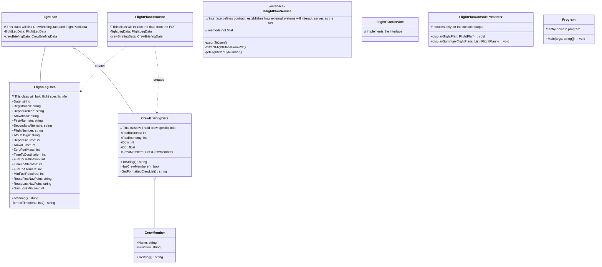

```mermaid
%%{init: {
  'flowchart': {
    'rankSpacing': 100,
    'nodeSpacing': 50
  },
  'themeVariables': {
    'primaryColor': '#ffcccc',
    'fontSize': '16px'
  }
}}%%
classDiagram
    class FlightLegData {
      // This class will hold flight specific info
      +Date: string
      +Registration: string
      +DepartureIcao: string
      +ArrivalIcao: string
      +FirstAlternate: string
      +SecondaryAlternate: string
      +FlightNumber: string
      +AtcCallsign: string
      +DepartureTime: int
      +ArrivalTime: int
      +ZeroFuelMass: int
      +TimeToDestination: int
      +FuelToDestination: int
      +TimeToAlternate: int
      +FuelToAlternate: int
      +MinFuelRequired: int
      +RouteFirstNavPoint: string
      +RouteLastNavPoint: string
      +GainLossMinutes: int
      +ToString() string
      -formatTime(time: int?) string
    }
    class CrewBriefingData {
       // This class will hold crew specific info
      +PaxBusiness: int
      +PaxEconomy: int
      +Dow: int
      +Doi: float
      +CrewMembers: List~CrewMember~
      +ToString() string
      -HasCrewMembers() bool
      -GetFormattedCrewList() string
    }
    class CrewMember {
      +Name: string
      +Function: string
      +ToString() string
    }
    class FlightPlan {
      // This class will link CrewBriefingData and FlightPlanData
      -flightLegData: FlightLegData
      -crewBriefingData: CrewBriefingData
    }
    class FlightPlanExtractor {
      // This class will extract the data from the PDF
      -flightLegData: FlightLegData
      -crewBriefingData: CrewBriefingData
    }
    class IFlightPlanService {
      // interface defines contract, establishes how external systems will interact. serves as the API 
      // methods not final
      <<interface>>
      exportToJson()
      extractFlightPlansFromPdf()
      getFlightPlanByNumber()
    }
    class FlightPlanService {
      // implements the interface
    }
    class FlightPlanConsolePresenter {
      // focuses only on the console output
      +display(flightPlan: FlightPlan): void
      +displaySummary(flightPlans: List~FlightPlan~): void
    }
    class Program {
      // entry point to program
      +Main(args: string[]): void
    }
    FlightPlan o-- FlightLegData
    FlightPlan o-- CrewBriefingData
    FlightPlanExtractor ..> FlightLegData : creates
    FlightPlanExtractor ..> CrewBriefingData : creates
    CrewBriefingData o-- CrewMember
```