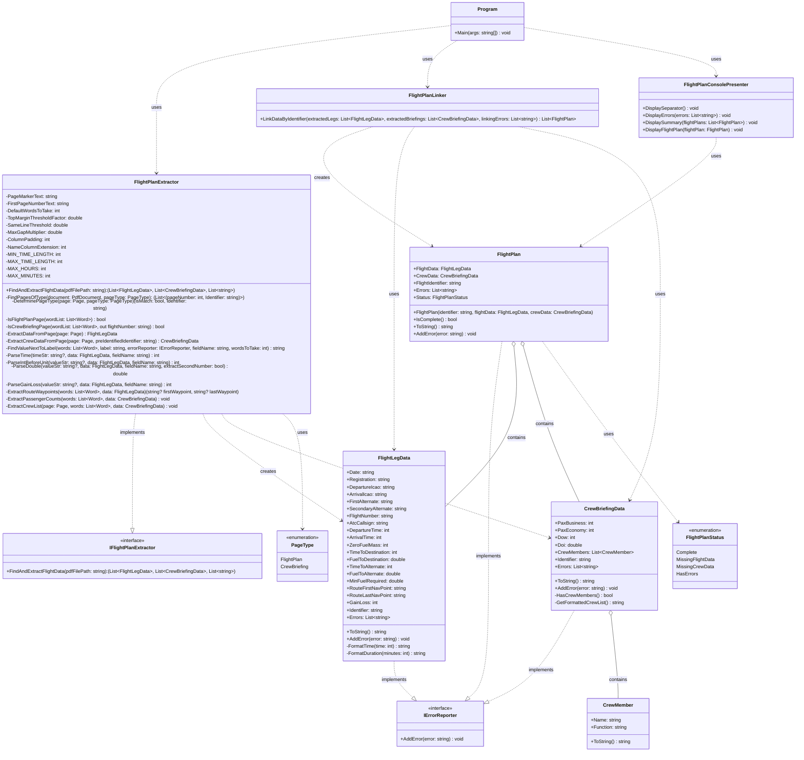

```mermaid
%%{init: {
  'flowchart': {
    'rankSpacing': 100,
    'nodeSpacing': 50
  },
  'themeVariables': {
    'primaryColor': '#ffcccc',
    'fontSize': '16px'
  }
}}%%
classDiagram
    class CrewBriefingData {       
      +PaxBusiness: int
      +PaxEconomy: int
      +Dow: int
      +Doi: double
      +CrewMembers: List~CrewMember~
      +Identifier: string
      +Errors: List~string~
      +ToString() string
      +AddError(error: string) void
      -HasCrewMembers() bool
      -GetFormattedCrewList() string
    }
    class CrewMember {
      +Name: string
      +Function: string
      +ToString() string
    }
    class FlightLegData {      
      +Date: string
      +Registration: string
      +DepartureIcao: string
      +ArrivalIcao: string
      +FirstAlternate: string
      +SecondaryAlternate: string
      +FlightNumber: string
      +AtcCallsign: string
      +DepartureTime: int
      +ArrivalTime: int
      +ZeroFuelMass: int
      +TimeToDestination: int
      +FuelToDestination: double
      +TimeToAlternate: int
      +FuelToAlternate: double
      +MinFuelRequired: double
      +RouteFirstNavPoint: string
      +RouteLastNavPoint: string
      +GainLoss: int
      +Identifier: string
      +Errors: List~string~
      +ToString() string
      +AddError(error: string) void
      -FormatTime(time: int) string
      -FormatDuration(minutes: int) string            
    }
    class FlightPlan {
      +FlightData: FlightLegData
      +CrewData: CrewBriefingData
      +FlightIdentifier: string
      +Errors: List~string~
      +Status: FlightPlanStatus
      +FlightPlan(identifier: string, flightData: FlightLegData, crewData: CrewBriefingData)
      +IsComplete() bool
      +ToString() string
      +AddError(error: string) void
    }
    class FlightPlanStatus {
      <<enumeration>>
      Complete
      MissingFlightData
      MissingCrewData
      HasErrors
    }
    class FlightPlanConsolePresenter {
      +DisplaySeparator() void
      +DisplayErrors(errors: List~string~) void
      +DisplaySummary(flightPlans: List~FlightPlan~) void
      +DisplayFlightPlan(flightPlan: FlightPlan) void
    }
    class FlightPlanExtractor {        
      -PageMarkerText: string
      -FirstPageNumberText: string
      -DefaultWordsToTake: int
      -TopMarginThresholdFactor: double
      -SameLineThreshold: double
      -MaxGapMultiplier: double
      -ColumnPadding: int
      -NameColumnExtension: int
      -MIN_TIME_LENGTH: int
      -MAX_TIME_LENGTH: int
      -MAX_HOURS: int
      -MAX_MINUTES: int
      +FindAndExtractFlightData(pdfFilePath: string):(List~FlightLegData~, List~CrewBriefingData~, List~string~)
      -FindPagesOfType(document: PdfDocument, pageType: PageType): (List<(pageNumber: int, Identifier: string)>)
      -DeterminePageType(page: Page, pageType: PageType) (isMatch: bool, Identifier: string)
      -IsFlightPlanPage(wordList: List~Word~) bool
      -IsCrewBriefingPage(wordList: List~Word~, out flightNumber: string) bool
      -ExtractDataFromPage(page: Page) FlightLegData
      -ExtractCrewDataFromPage(page: Page, preIdentifiedIdentifier: string) CrewBriefingData
      -FindValueNextToLabel(words: List~Word~, label: string, errorReporter: IErrorReporter, fieldName: string, wordsToTake: int) string
      -ParseTime(timeStr: string?, data: FlightLegData, fieldName: string) int
      -ParseIntBeforeUnit(valueStr: string?, data: FlightLegData, fieldName: string) int
      -ParseDouble(valueStr: string?, data: FlightLegData, fieldName: string, extractSecondNumber: bool) double
      -ParseGainLoss(valueStr: string?, data: FlightLegData, fieldName: string) int
      -ExtractRouteWaypoints(words: List~Word~, data: FlightLegData) (string? firstWaypoint, string? lastWaypoint)
      -ExtractPassengerCounts(words: List~Word~, data: CrewBriefingData) void
      -ExtractCrewList(page: Page, words: List~Word~, data: CrewBriefingData) void
    }
    class FlightPlanLinker {
      +LinkDataByIdentifier(extractedLegs: List~FlightLegData~, extractedBriefings: List~CrewBriefingData~, linkingErrors: List~string~) List~FlightPlan~
    }
    class IErrorReporter {
      <<interface>>
      +AddError(error: string) void
    }
    class IFlightPlanExtractor {
      <<interface>>
      +FindAndExtractFlightData(pdfFilePath: string):(List~FlightLegData~, List~CrewBriefingData~, List~string~)
    }
    class PageType {
      <<enumeration>>
      FlightPlan
      CrewBriefing
    }
    class Program {
      +Main(args: string[]) void
    }
    FlightPlanExtractor ..|> IFlightPlanExtractor : implements
    FlightLegData ..|> IErrorReporter : implements
    CrewBriefingData ..|> IErrorReporter : implements
    FlightPlan ..|> IErrorReporter : implements

    FlightPlanExtractor ..> FlightLegData : creates
    FlightPlanExtractor ..> CrewBriefingData : creates
    FlightPlanExtractor ..> PageType : uses

    FlightPlanLinker ..> FlightPlan : creates
    FlightPlanLinker ..> FlightLegData : uses
    FlightPlanLinker ..> CrewBriefingData : uses

    FlightPlanConsolePresenter ..> FlightPlan : uses

    Program ..> FlightPlanExtractor : uses
    Program ..> FlightPlanLinker : uses
    Program ..> FlightPlanConsolePresenter : uses

    CrewBriefingData o-- CrewMember : contains
    FlightPlan o-- FlightLegData : contains
    FlightPlan o-- CrewBriefingData : contains

    FlightPlan ..> FlightPlanStatus : uses
```